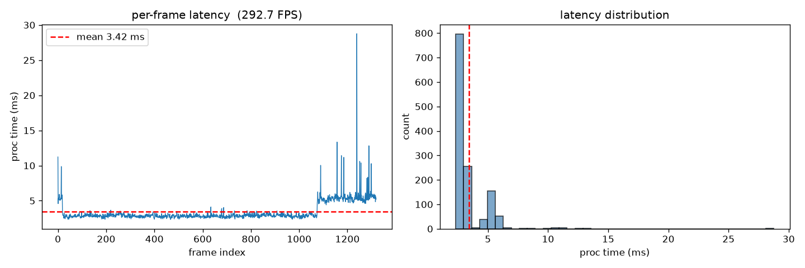
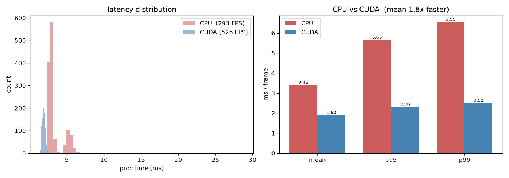
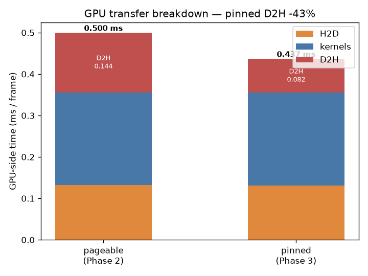
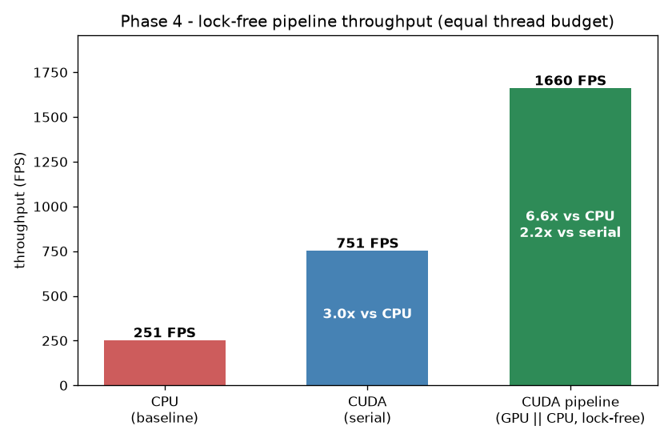

# GPU 가속 결함 검출 파이프라인

산업 표면 결함을 찾는 영상처리 파이프라인을 만들고, **CPU → CUDA → 멀티스레드** 순서로 단계별로 빠르게 만들어보면서 속도를 직접 측정해 본 개인 학습 프로젝트입니다.

CUDA랑 실시간 처리를 공부하는 게 목적이라, 결함 검출은 딥러닝 대신 **고전 비전(차분 → 블러 → 이진화 → 모폴로지 → 라벨링)으로 직접 구현**했습니다. MVTec AD 데이터셋을 카메라 스트림처럼 흘려보내서, 카메라 없이도 전체 파이프라인을 테스트합니다.

## 단계별 진행

| Phase | 내용 | 상태 |
|-------|------|------|
| 1 | CPU 단일스레드 버전 (OpenCV) + 처리시간 측정 | ✅ |
| 2 | CUDA 커널로 포팅 (absdiff·blur·threshold·morphology) | ✅ |
| 3 | pinned(page-locked) memory + async 전송 | ✅ |
| 4 | 멀티스레드 파이프라인 (GPU / CPU 스테이지 분리, lock-free 큐) | ✅ |
| 5 | (예정) 라벨링도 GPU로 / 해상도 올려서 비교 | ⬜ |

측정 조건: `detect()`만 측정(이미지 로드 제외), MVTec capsule test 132장 × 10회 = **1320 프레임**.
환경: AMD EPYC 7B13, RTX A5000(sm_86), Ubuntu 24.04, g++ 13.3 `-O3`, OpenCV 4.6, CUDA 12.8, 이미지 1000×1000.

## Phase 1 — CPU 기준

먼저 CPU 단일스레드로 만들어서 기준 속도를 잡았습니다. 이후 단계들은 전부 이 값과 비교합니다.

| 지표 | 값 |
|------|-----|
| mean | 3.42 ms/frame |
| p95 / p99 | 5.65 / 6.52 ms |
| FPS | 293 |
| frame drop | 0 |



> 검출 파라미터(threshold 등)는 아직 안 맞춰서 정상 이미지도 결함으로 잡히는 경우가 있습니다. 이 단계 목적은 **속도 기준선**이라 검출 품질 튜닝은 다음으로 미뤘습니다.

## Phase 2 — CUDA로 포팅

absdiff·가우시안 블러·이진화·모폴로지를 직접 CUDA 커널로 작성했습니다. 라벨링(CCL)은 GPU 구현이 복잡해서 일단 CPU에 남겨뒀습니다.

| 지표 | CPU | CUDA | |
|------|------|------|------|
| mean | 3.42 ms | 1.90 ms | 1.8× |
| FPS | 293 | 525 | |
| 검출 결과 | 1250 | 1250 | 동일 |



CUDA event로 구간을 재보니 GPU에서 쓰는 시간(H2D+커널+D2H)은 ~0.5 ms뿐이고, 나머지(~1.4 ms)는 **CPU에 남은 라벨링**이 먹고 있었습니다. 즉 병목이 픽셀 연산에서 전송 + CPU 쪽으로 옮겨갔습니다.

> 메모: CUDA 코드는 pImpl로 `.cu` 안에 숨겨서 `main.cpp`(g++)랑 커널(nvcc)을 따로 컴파일했습니다. 가우시안 가중치/모폴로지 커널 모양은 constant memory에 올렸습니다.

## Phase 3 — pinned memory

전송을 빠르게 하려고 입출력 버퍼를 `cudaHostAlloc`(page-locked)으로 바꾸고 async 전송으로 바꿨습니다. 같은 실행 파일에서 pinned / pageable을 골라 비교했습니다.

| GPU 구간 | pageable | pinned | |
|------|------|------|------|
| H2D | 0.132 ms | 0.131 ms | 비슷 |
| 커널 | 0.224 ms | 0.224 ms | 동일 |
| D2H | 0.144 ms | 0.082 ms | -43% |



**D2H 전송은 확실히 빨라졌는데, 정작 전체 속도(detect())는 거의 그대로였습니다.** 왜인지 봤더니 ① pageable 프레임을 pinned 버퍼로 옮기는 복사가 추가됐고, ② 전체 시간의 대부분은 여전히 CPU 라벨링이라 그렇더라고요. "교과서에 나온 최적화라고 무조건 전체가 빨라지는 건 아니다"를 직접 확인한 단계였습니다. 전송을 비동기로 만들어 둔 덕은 다음 단계에서 봤습니다.

## Phase 4 — 멀티스레드 파이프라인

GPU 시간은 이미 짧고 CPU 라벨링이 병목이라, 전송만 겹치는 걸로는 의미가 없었습니다. 그래서 **GPU 처리와 CPU 라벨링을 아예 다른 스레드로 나눠서** 서로 다른 프레임을 동시에 처리하게 했습니다. 이러면 전체 속도가 두 작업의 합이 아니라 **더 느린 쪽** 기준으로 정해집니다.

`프레임 공급 → [큐] → GPU → [큐] → CPU 라벨링` 구조로, 스테이지 사이를 **직접 구현한 lock-free SPSC 큐**로 연결했습니다.

| 구성 | per-frame | FPS | |
|------|------|------|------|
| CPU | 4.0 ms | 251 | |
| CUDA 직렬 | 1.33 ms | 751 | |
| CUDA 파이프라인 | 0.60 ms | 1660 | 직렬 대비 2.2× |



frame drop은 큐가 가득 차면 기다리는 방식(백프레셔)이라 0입니다.

> 삽질 메모: 처음엔 파이프라인이 오히려 **117 FPS로 더 느렸습니다.** 알고 보니 OpenCV가 코어 수(128개)만큼 스레드를 띄우는데, 라벨링을 매 프레임 호출하니 스레드 만드는 오버헤드가 더 커졌더라고요. ① 큐 대기를 무한 스핀 대신 살짝 쉬도록(backoff) 바꾸고 ② OpenCV 스레드 수를 실제 쓸 수 있는 코어 수로 제한하니 1660 FPS로 돌아왔습니다.

## 코드 구조

- `IFrameSource` / `IDefectDetector` 인터페이스로 추상화해서, 파일/카메라/CPU/CUDA 구현을 바꿔 끼울 수 있게 했습니다.
- 인터페이스는 프레임당 1번만 호출돼서 가상 함수 비용은 신경 안 써도 되고, 픽셀 단위 연산은 구현체 안의 직선 코드/커널로 처리합니다.

## 알고리즘

정상 이미지 평균으로 기준 이미지를 만들고 → 입력과 차분 → 블러 → 이진화 → 모폴로지(open/close) → Connected Component Labeling → 결함 박스 추출.

## 데이터셋

[MVTec AD (MVTec Anomaly Detection)](https://www.mvtec.com/company/research/datasets/mvtec-ad)의 `capsule` 카테고리를 사용합니다.

- 라이선스: CC BY-NC-SA 4.0 (연구·비상업 용도)
- 데이터는 이 저장소에 포함하지 않습니다. 위 링크에서 받아서 아래 구조로 두면 됩니다:
  ```
  capsule/
  ├── train/good/
  ├── test/{good,crack,faulty_imprint,poke,scratch,squeeze}/
  └── ground_truth/
  ```
- 인용:
  > P. Bergmann, M. Fauser, D. Sattlegger, C. Steger.
  > "MVTec AD — A Comprehensive Real-World Dataset for Unsupervised Anomaly Detection." *CVPR*, 2019.

## 빌드

```bash
mkdir -p build && cd build
cmake .. -DCMAKE_BUILD_TYPE=Release      # 기본 CUDA 포함
# cmake .. -DUSE_CUDA=OFF                 # CUDA 없는 환경이면 CPU 전용으로
make -j$(nproc)
```

## 실행

```bash
# ./defect_pipeline <데이터경로> [cpu|cuda|cuda-pageable|cuda-pipe] [반복횟수] [csv]
./defect_pipeline /root/mvtec/capsule cpu       10 ../bench/cpu.csv
./defect_pipeline /root/mvtec/capsule cuda      10 ../bench/cuda.csv     # pinned 직렬
./defect_pipeline /root/mvtec/capsule cuda-pipe 10 ../bench/pipe.csv     # 멀티스레드

# OpenCV 스레드 수 조절(코어 제한 환경에서 필요)
CV_THREADS=10 ./defect_pipeline /root/mvtec/capsule cuda 10 ../bench/cuda.csv
```

측정 항목: mean/min/max/stddev, p50/p95/p99, FPS, frame drop, CSV 로그(→ matplotlib 그래프).
